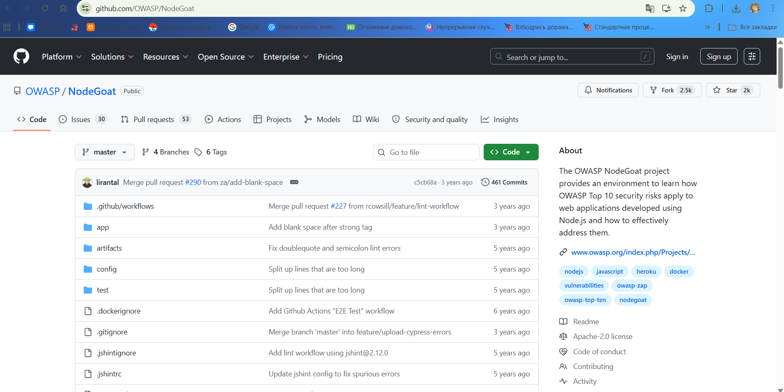
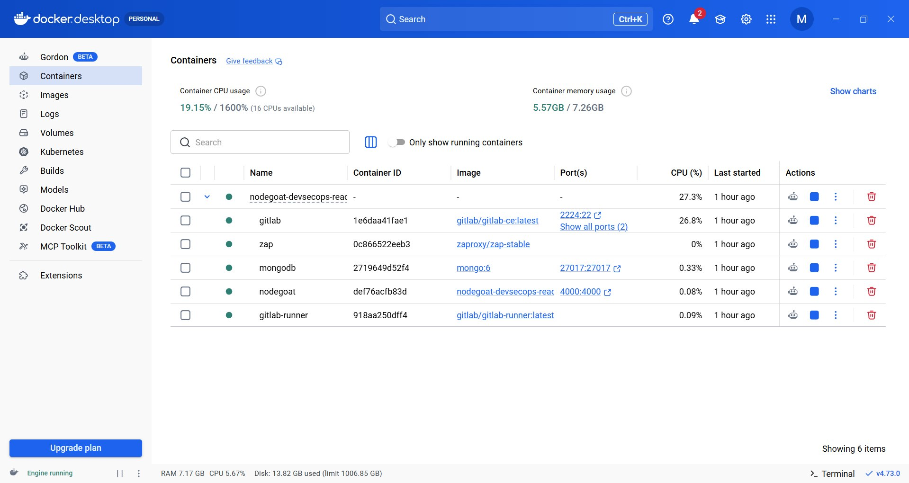
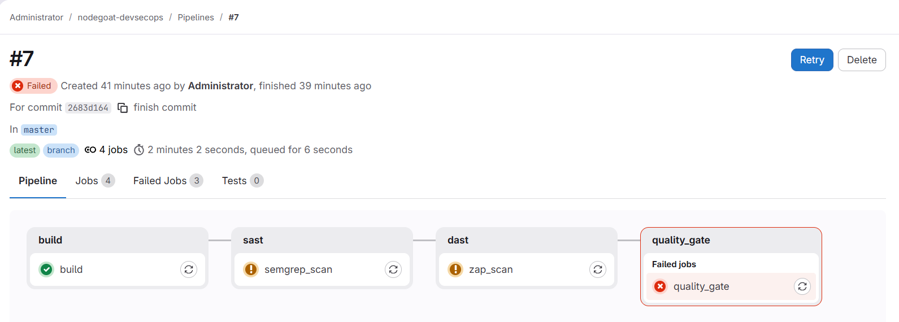

# Лабораторная работа DevSecOps CI/CD Pipeline

## Тема: Автоматизация статического и динамического анализа уязвимого open-source приложения OWASP NodeGoat с использованием GitLab CI/CD, Semgrep и OWASP ZAP.
**Выполнила: Миронова Дарья Евгеньевна**

**Группа: 535кибер**

**Целью работы** является построение DevSecOps-конвейера для автоматизированного выявления уязвимостей в open-source приложении.

В рамках работы были реализованы:

* динамический анализ безопасности с использованием OWASP ZAP;
* статический анализ исходного кода с использованием Semgrep;
* CI/CD pipeline в GitLab;
* quality gate, блокирующий сборку при обнаружении уязвимостей.

В качестве уязвимого приложения было выбрано `OWASP NodeGoat`.

Репозиторий:
https://github.com/OWASP/NodeGoat

NodeGoat представляет собой преднамернное уязвимое Node.js приложение, предназначенное для изучения OWASP Top 10 и практики анализа уязвимостей.



## Архитектура стенда

| Контейнер     | Назначение               |
| ------------- | ------------------------ |
| GitLab        | CI/CD                    |
| GitLab Runner | выполнение pipeline      |
| NodeGoat      | vulnerable app           |
| MongoDB       | БД                       |
| ZAP           | dynamic analysis         |



С помощью  `docker-compose.yml`был описан полный DevSecOps-стенд:
```yaml
version: '3.9'

services:

  gitlab:
    image: gitlab/gitlab-ce:latest
    hostname: gitlab
    container_name: gitlab
    restart: always

    ports:
      - "8929:8929"
      - "2224:22"

    environment:
      GITLAB_OMNIBUS_CONFIG: |
        external_url 'http://gitlab:8929'
        nginx['listen_port'] = 8929

    volumes:
      - ./gitlab/config:/etc/gitlab
      - ./gitlab/logs:/var/log/gitlab
      - ./gitlab/data:/var/opt/gitlab

  runner:
    image: gitlab/gitlab-runner:latest
    container_name: gitlab-runner
    restart: always

    depends_on:
      - gitlab

    volumes:
      - ./runner/config:/etc/gitlab-runner
      - /var/run/docker.sock:/var/run/docker.sock

  mongodb:
    image: mongo:6
    container_name: mongodb
    restart: always

    ports:
      - "27017:27017"

  nodegoat:
    build:
      context: ./nodegoat

    container_name: nodegoat
    restart: always

    depends_on:
      - mongodb

    environment:
      - MONGODB_URI=mongodb://mongodb:27017/nodegoat

    ports:
      - "4000:4000"

  zap:
    image: zaproxy/zap-stable
    container_name: zap
    tty: true
```

Для статического анализа использовался инструмент `Semgrep`.

Было реализовано пользовательское правило для обнаружения NoSQL Injection в NodeGoat.
Semgrep анализирует JavaScript-код и выявляет небезопасные конструкции при работе с MongoDB-запросами.

 Правило находится в nodegoat\semgrep\nosqli.yaml :

```yaml
rules:
  - id: mongodb-nosqli
    pattern-either:
      - pattern: |
          $COLLECTION.find($QUERY)
      - pattern: |
          $COLLECTION.findOne($QUERY)
      - pattern: |
          $COLLECTION.update($QUERY, ...)
      - pattern: |
          $COLLECTION.remove($QUERY)

    message: Potential NoSQL Injection in MongoDB query
    languages:
      - javascript
    severity: ERROR
```

Для динамического анализа использовался OWASP ZAP.
ZAP выполнял автоматическое сканирование приложения NodeGoat и обнаруживал инъекционные уязвимости.

В отличие от статического анализатора, ZAP не требует написания кастомных правил для базовой проверки. Запуск сканера описан в файле `.gitlab-ci.yml` в стадии `dast`:

```yaml
zap_scan:
  stage: dast
  image: zaproxy/zap-stable
  tags:
    - docker
  when: always
  script:
    - zap-baseline.py -t http://nodegoat:4000
  allow_failure: true
  ```

Для выполнения CI/CD процессов исходный код уязвимого приложения был загружен в развернутый локальный GitLab. Для этого была удалена связь с оригинальным репозиторием на GitHub и добавлен локальный `origin`:

```bash
git remote remove origin
git remote add origin [http://gitlab.local:8929/root/nodegoat-devsecops.git](http://gitlab.local:8929/root/nodegoat-devsecops.git)
git add .
git commit -m "finish commit"
git push -u origin master
```

### Инициализация проекта и настройка среды выполнения
Чтобы GitLab мог выполнять задачи, описанные в .gitlab-ci.yml, был создан и зарегистрирован локальный GitLab Runner. В качестве среды выполнения был выбран docker, а сам Runner был объединен в общую Docker-сеть со стендом для обеспечения доступа к уязвимому приложению.

## Запуск Pipeline и результаты проверок
Сразу после успешной загрузки кода (push) и регистрации Runner'а, GitLab автоматически инициировал процесс выполнения CI/CD Pipeline.

Конвейер прошел стадии сборки и сканирования, после чего, как и ожидалось, Quality Gate успешно отработал и прервал процесс, присвоив сборке статус FAILED. Это подтверждает, что уязвимый код был автоматически заблокирован.



Подробные результаты работы статического и динамического анализаторов зафиксированы в логах выполнения соответствующих задач:

<details>
<summary>Посмотреть логи Semgrep (SAST)</summary>

```text
Running with gitlab-runner 18.11.3 (ad1797b3)
  on docker hiXIqFkrE, system ID: r_CMlrnZS5eUbl
Preparing the "docker" executor
00:03
Using Docker executor with image returntocorp/semgrep ...
Using effective pull policy of [always] for container returntocorp/semgrep
Pulling docker image returntocorp/semgrep ...
Using docker image sha256:9349edbadf90c3f3c0c3f55867625354e89680e6fa10d9034042af52fdb0e0d0 for returntocorp/semgrep with digest returntocorp/semgrep@sha256:9349edbadf90c3f3c0c3f55867625354e89680e6fa10d9034042af52fdb0e0d0 ...
Preparing environment
00:01
Using effective pull policy of [always] for container sha256:571952e633d345c74af6458eda2948da99cf5315ce9017e1cab22a4c2226887c
Running on runner-hixiqfkre-project-1-concurrent-0 via e18ee6b6dacb...
Getting source from Git repository
00:02
Gitaly correlation ID: 01KRSD2RA9G4JMEPWZ5MVRW2VH
Fetching changes with git depth set to 20...
Reinitialized existing Git repository in /builds/root/nodegoat-devsecops/.git/
Created fresh repository.
Checking out 2683d164 as detached HEAD (ref is master)...
Skipping Git submodules setup
Executing "step_script" stage of the job script
00:06
Using effective pull policy of [always] for container returntocorp/semgrep
Using docker image sha256:9349edbadf90c3f3c0c3f55867625354e89680e6fa10d9034042af52fdb0e0d0 for returntocorp/semgrep with digest returntocorp/semgrep@sha256:9349edbadf90c3f3c0c3f55867625354e89680e6fa10d9034042af52fdb0e0d0 ...
$ semgrep --config semgrep/nosqli.yaml . --error
               
               
┌─────────────┐
│ Scan Status │
└─────────────┘
  Scanning 80 files tracked by git with 1 Code rule:
  Scanning 27 files.
                   
                   
┌─────────────────┐
│ 9 Code Findings │
└─────────────────┘
                               
    app/data/allocations-dao.js
   ❯❯❱ semgrep.mongodb-nosqli
          ❰❰ Blocking ❱❱
          Potential NoSQL Injection in MongoDB query
                                                    
           29┆ allocationsCol.update({
           30┆     userId: parsedUserId
           31┆ }, allocations, {
           32┆     upsert: true
           33┆ }, err => {
           34┆
           35┆     if (!err) {
           36┆
           37┆         console.log("Updated allocations");
           38┆
             [hid 16 additional lines, adjust with --max-lines-per-finding] 
           86┆ allocationsCol.find(searchCriteria()).toArray((err, allocations) => {
                            
    app/data/benefits-dao.js
   ❯❯❱ semgrep.mongodb-nosqli
          ❰❰ Blocking ❱❱
          Potential NoSQL Injection in MongoDB query
                                                    
           16┆ usersCol.find({
           17┆     "isAdmin": {
           18┆         $ne: true
           19┆     }
           20┆ }).toArray((err, users) => callback(null, users));
            ⋮┆----------------------------------------
           24┆ usersCol.update({
           25┆         _id: parseInt(userId)
           26┆     }, {
           27┆         $set: {
           28┆             benefitStartDate: startDate
           29┆         }
           30┆     },
           31┆     (err, result) => {
           32┆         if (!err) {
           33┆             console.log("Updated benefits");
             [hid 6 additional lines, adjust with --max-lines-per-finding] 
                                 
    app/data/contributions-dao.js
   ❯❯❱ semgrep.mongodb-nosqli
          ❰❰ Blocking ❱❱
          Potential NoSQL Injection in MongoDB query
                                                    
           28┆ contributionsDB.update({
           29┆     userId
           30┆     },
           31┆     contributions, {
           32┆         upsert: true
           33┆     },
           34┆     err => {
           35┆         if (!err) {
           36┆             console.log("Updated contributions");
           37┆             // add user details
             [hid 16 additional lines, adjust with --max-lines-per-finding] 
                         
    app/data/memos-dao.js
   ❯❯❱ semgrep.mongodb-nosqli
          ❰❰ Blocking ❱❱
          Potential NoSQL Injection in MongoDB query
                                                    
           28┆ memosCol.find({}).sort({
                           
    app/data/profile-dao.js
   ❯❯❱ semgrep.mongodb-nosqli
          ❰❰ Blocking ❱❱
          Potential NoSQL Injection in MongoDB query
                                                    
           78┆ users.update({
           79┆         _id: parseInt(userId)
           80┆     }, {
           81┆         $set: user
           82┆     },
           83┆     err => {
           84┆         if (!err) {
           85┆             console.log("Updated user profile");
           86┆             return callback(null, user);
           87┆         }
             [hid 4 additional lines, adjust with --max-lines-per-finding] 
                               
    app/routes/contributions.js
   ❯❯❱ semgrep.mongodb-nosqli
          ❰❰ Blocking ❱❱
          Potential NoSQL Injection in MongoDB query
                                                    
           65┆ contributionsDAO.update(userId, preTax, afterTax, roth, (err, contributions) => {
           66┆
           67┆     if (err) return next(err);
           68┆
           69┆     contributions.updateSuccess = true;
           70┆     return res.render("contributions", {
           71┆         ...contributions,
           72┆         environmentalScripts
           73┆     });
           74┆ });
                         
    app/routes/session.js
   ❯❯❱ semgrep.mongodb-nosqli
          ❰❰ Blocking ❱❱
          Potential NoSQL Injection in MongoDB query
                                                    
           20┆ allocationsDAO.update(user._id, stocks, funds, bonds, (err) => {
           21┆     if (err) return next(err);
           22┆ });
                
                
┌──────────────┐
│ Scan Summary │
└──────────────┘
✅ Scan completed successfully.
 • Findings: 9 (9 blocking)
 • Rules run: 1
 • Targets scanned: 27
 • Parsed lines: ~100.0%
 • Scan skipped: 
   ◦ Files matching .semgrepignore patterns: 36
 • Scan was limited to files tracked by git
 • For a detailed list of skipped files and lines, run semgrep with the --verbose flag
Ran 1 rule on 27 files: 9 findings.
Cleaning up project directory and file based variables
00:01
ERROR: Job failed: exit code 1
```
</details>

<details>
<summary>Посмотреть логи ZAP (DAST)</summary>

```text
Running with gitlab-runner 18.11.3 (ad1797b3)
  on docker hiXIqFkrE, system ID: r_CMlrnZS5eUbl
Preparing the "docker" executor
00:02
Using Docker executor with image zaproxy/zap-stable ...
Using effective pull policy of [always] for container zaproxy/zap-stable
Pulling docker image zaproxy/zap-stable ...
Using docker image sha256:8770b23f9e8b49038f413cb2b10c58c901e5b6717be221a22b1bcab5c9771b8a for zaproxy/zap-stable with digest zaproxy/zap-stable@sha256:8770b23f9e8b49038f413cb2b10c58c901e5b6717be221a22b1bcab5c9771b8a ...
Preparing environment
00:01
Using effective pull policy of [always] for container sha256:571952e633d345c74af6458eda2948da99cf5315ce9017e1cab22a4c2226887c
Running on runner-hixiqfkre-project-1-concurrent-0 via e18ee6b6dacb...
Getting source from Git repository
00:02
Gitaly correlation ID: 01KRSD38BN4H8VRFF3NHNMJD6F
Fetching changes with git depth set to 20...
Reinitialized existing Git repository in /builds/root/nodegoat-devsecops/.git/
Created fresh repository.
Checking out 2683d164 as detached HEAD (ref is master)...
Skipping Git submodules setup
Executing "step_script" stage of the job script
00:45
Using effective pull policy of [always] for container zaproxy/zap-stable
Using docker image sha256:8770b23f9e8b49038f413cb2b10c58c901e5b6717be221a22b1bcab5c9771b8a for zaproxy/zap-stable with digest zaproxy/zap-stable@sha256:8770b23f9e8b49038f413cb2b10c58c901e5b6717be221a22b1bcab5c9771b8a ...
$ zap-baseline.py -t http://nodegoat:4000
Using the Automation Framework
Total of 52 URLs
PASS: In Page Banner Information Leak [10009]
PASS: Cookie No HttpOnly Flag [10010]
PASS: Cookie Without Secure Flag [10011]
PASS: Re-examine Cache-control Directives [10015]
PASS: Content-Type Header Missing [10019]
PASS: Information Disclosure - Debug Error Messages [10023]
PASS: Information Disclosure - Sensitive Information in URL [10024]
PASS: Information Disclosure - Sensitive Information in HTTP Referrer Header [10025]
PASS: HTTP Parameter Override [10026]
PASS: Off-site Redirect [10028]
PASS: Cookie Poisoning [10029]
PASS: User Controllable Charset [10030]
PASS: User Controllable HTML Element Attribute (Potential XSS) [10031]
PASS: Viewstate [10032]
PASS: Directory Browsing [10033]
PASS: Heartbleed OpenSSL Vulnerability (Indicative) [10034]
PASS: Strict-Transport-Security Header [10035]
PASS: HTTP Server Response Header [10036]
PASS: X-Backend-Server Header Information Leak [10039]
PASS: Secure Pages Include Mixed Content [10040]
PASS: HTTP to HTTPS Insecure Transition in Form Post [10041]
PASS: HTTPS to HTTP Insecure Transition in Form Post [10042]
PASS: User Controllable JavaScript Event (XSS) [10043]
PASS: Big Redirect Detected (Potential Sensitive Information Leak) [10044]
PASS: Retrieved from Cache [10050]
PASS: X-ChromeLogger-Data (XCOLD) Header Information Leak [10052]
PASS: X-Debug-Token Information Leak [10056]
PASS: Username Hash Found [10057]
PASS: X-AspNet-Version Response Header [10061]
PASS: PII Disclosure [10062]
PASS: Timestamp Disclosure [10096]
PASS: Hash Disclosure [10097]
PASS: Cross-Domain Misconfiguration [10098]
PASS: Weak Authentication Method [10105]
PASS: Reverse Tabnabbing [10108]
PASS: Verification Request Identified [10113]
PASS: Script Served From Malicious Domain (polyfill) [10115]
PASS: ZAP is Out of Date [10116]
PASS: Absence of Anti-CSRF Tokens [10202]
PASS: Private IP Disclosure [2]
PASS: Session ID in URL Rewrite [3]
PASS: Script Passive Scan Rules [50001]
PASS: Stats Passive Scan Rule [50003]
PASS: Insecure JSF ViewState [90001]
PASS: Java Serialization Object [90002]
PASS: Sub Resource Integrity Attribute Missing [90003]
PASS: Charset Mismatch [90011]
PASS: WSDL File Detection [90030]
PASS: Loosely Scoped Cookie [90033]
WARN-NEW: Vulnerable JS Library [10003] x 2 
	http://nodegoat:4000/vendor/bootstrap/bootstrap.js (200 OK)
	http://nodegoat:4000/vendor/jquery.min.js (200 OK)
WARN-NEW: Cross-Domain JavaScript Source File Inclusion [10017] x 5 
	http://nodegoat:4000 (200 OK)
	http://nodegoat:4000/login (200 OK)
	http://nodegoat:4000/signup (200 OK)
	http://nodegoat:4000/tutorial/a3 (200 OK)
	http://nodegoat:4000/tutorial/a5 (200 OK)
WARN-NEW: Missing Anti-clickjacking Header [10020] x 5 
	http://nodegoat:4000 (200 OK)
	http://nodegoat:4000/login (200 OK)
	http://nodegoat:4000/signup (200 OK)
	http://nodegoat:4000/tutorial/a3 (200 OK)
	http://nodegoat:4000/tutorial/a5 (200 OK)
WARN-NEW: X-Content-Type-Options Header Missing [10021] x 5 
	http://nodegoat:4000/images/owasplogo.png (200 OK)
	http://nodegoat:4000/signup (200 OK)
	http://nodegoat:4000/vendor/bootstrap/bootstrap.css (200 OK)
	http://nodegoat:4000/vendor/theme/font-awesome/css/font-awesome.min.css (200 OK)
	http://nodegoat:4000/vendor/theme/sb-admin.css (200 OK)
WARN-NEW: Information Disclosure - Suspicious Comments [10027] x 10 
	http://nodegoat:4000/tutorial (200 OK)
	http://nodegoat:4000/tutorial (200 OK)
	http://nodegoat:4000/tutorial (200 OK)
	http://nodegoat:4000/tutorial/a1 (200 OK)
	http://nodegoat:4000/tutorial/a1 (200 OK)
WARN-NEW: Server Leaks Information via "X-Powered-By" HTTP Response Header Field(s) [10037] x 5 
	http://nodegoat:4000 (302 Found)
	http://nodegoat:4000/images/owasplogo.png (200 OK)
	http://nodegoat:4000/sitemap.xml (404 Not Found)
	http://nodegoat:4000/vendor/theme/font-awesome/css/font-awesome.min.css (200 OK)
	http://nodegoat:4000/vendor/theme/sb-admin.css (200 OK)
WARN-NEW: Content Security Policy (CSP) Header Not Set [10038] x 5 
	http://nodegoat:4000 (200 OK)
	http://nodegoat:4000/login (200 OK)
	http://nodegoat:4000/signup (200 OK)
	http://nodegoat:4000/tutorial/a3 (200 OK)
	http://nodegoat:4000/tutorial/a5 (200 OK)
WARN-NEW: Non-Storable Content [10049] x 12 
	http://nodegoat:4000 (302 Found)
	http://nodegoat:4000/ (302 Found)
	http://nodegoat:4000/login (500 Internal Server Error)
	http://nodegoat:4000 (200 OK)
	http://nodegoat:4000/login (200 OK)
WARN-NEW: Cookie without SameSite Attribute [10054] x 3 
	http://nodegoat:4000 (302 Found)
	http://nodegoat:4000/robots.txt (404 Not Found)
	http://nodegoat:4000/sitemap.xml (404 Not Found)
WARN-NEW: CSP: Failure to Define Directive with No Fallback [10055] x 5 
	http://nodegoat:4000/allocations/ (404 Not Found)
	http://nodegoat:4000/h2 (404 Not Found)
	http://nodegoat:4000/robots.txt (404 Not Found)
	http://nodegoat:4000/server.js (404 Not Found)
	http://nodegoat:4000/sitemap.xml (404 Not Found)
WARN-NEW: Permissions Policy Header Not Set [10063] x 5 
	http://nodegoat:4000 (200 OK)
	http://nodegoat:4000/robots.txt (404 Not Found)
	http://nodegoat:4000/signup (200 OK)
	http://nodegoat:4000/sitemap.xml (404 Not Found)
	http://nodegoat:4000/login (500 Internal Server Error)
WARN-NEW: Source Code Disclosure - SQL [10099] x 2 
	http://nodegoat:4000/tutorial (200 OK)
	http://nodegoat:4000/tutorial/a1 (200 OK)
WARN-NEW: Modern Web Application [10109] x 5 
	http://nodegoat:4000 (200 OK)
	http://nodegoat:4000/login (200 OK)
	http://nodegoat:4000/tutorial/a3 (200 OK)
	http://nodegoat:4000/tutorial/a5 (200 OK)
	http://nodegoat:4000/tutorial/ssrf (200 OK)
WARN-NEW: Dangerous JS Functions [10110] x 2 
	http://nodegoat:4000/tutorial (200 OK)
	http://nodegoat:4000/tutorial/a1 (200 OK)
WARN-NEW: Authentication Request Identified [10111] x 1 
	http://nodegoat:4000/login (500 Internal Server Error)
WARN-NEW: Session Management Response Identified [10112] x 2 
	http://nodegoat:4000 (302 Found)
	http://nodegoat:4000/sitemap.xml (404 Not Found)
WARN-NEW: Cross-Origin-Embedder-Policy Header Missing or Invalid [90004] x 11 
	http://nodegoat:4000 (200 OK)
	http://nodegoat:4000/login (200 OK)
	http://nodegoat:4000/signup (200 OK)
	http://nodegoat:4000 (200 OK)
	http://nodegoat:4000/login (200 OK)
WARN-NEW: Application Error Disclosure [90022] x 2 
	http://nodegoat:4000/login (500 Internal Server Error)
	http://nodegoat:4000/signup (500 Internal Server Error)
FAIL-NEW: 0	FAIL-INPROG: 0	WARN-NEW: 18	WARN-INPROG: 0	INFO: 0	IGNORE: 0	PASS: 49
Cleaning up project directory and file based variables
00:00
ERROR: Job failed: exit code 1
```
</details>

<details>
<summary>Посмотреть логи Quality Gate (quality_gate)</summary>

```text
Running with gitlab-runner 18.11.3 (ad1797b3)
  on docker hiXIqFkrE, system ID: r_CMlrnZS5eUbl
Preparing the "docker" executor
00:04
Using default image
Using Docker executor with image docker:latest ...
Using default image
Using effective pull policy of [always] for container docker:latest
Pulling docker image docker:latest ...
Using docker image sha256:8e3fae900cbfbdc14e8abca89a9e44363065cb535f34a09283c59cc0dde2de20 for docker:latest with digest docker@sha256:8e3fae900cbfbdc14e8abca89a9e44363065cb535f34a09283c59cc0dde2de20 ...
Preparing environment
00:00
Using effective pull policy of [always] for container sha256:571952e633d345c74af6458eda2948da99cf5315ce9017e1cab22a4c2226887c
Running on runner-hixiqfkre-project-1-concurrent-0 via e18ee6b6dacb...
Getting source from Git repository
00:02
Gitaly correlation ID: 01KRSD4XTF0WW17Y3GAS0Y7G75
Fetching changes with git depth set to 20...
Reinitialized existing Git repository in /builds/root/nodegoat-devsecops/.git/
Created fresh repository.
Checking out 2683d164 as detached HEAD (ref is master)...
Skipping Git submodules setup
Executing "step_script" stage of the job script
00:01
Using default image
Using effective pull policy of [always] for container docker:latest
Using docker image sha256:8e3fae900cbfbdc14e8abca89a9e44363065cb535f34a09283c59cc0dde2de20 for docker:latest with digest docker@sha256:8e3fae900cbfbdc14e8abca89a9e44363065cb535f34a09283c59cc0dde2de20 ...
$ echo "Checking security findings..."
Checking security findings...
$ exit 1
Cleaning up project directory and file based variables
00:01
ERROR: Job failed: exit code 1
```
</details>

## Вывод
В ходе выполнения лабораторной работы был успешно развернут локальный стенд DevSecOps, включающий системы контроля версий, CI/CD конвейер и уязвимое приложение NodeGoat.

На практике были применены инструменты статического (Semgrep) и динамического (OWASP ZAP) анализа безопасности. Их интеграция в пайплайн позволила автоматизировать выявление уязвимостей (таких как NoSQL инъекции, использование уязвимых компонентов и мисконфигурации) на ранних этапах разработки.

Настроенный Quality Gate доказал свою надежность, предотвратив дальнейшее продвижение кода при наличии критических угроз безопасности. Все поставленные задачи выполнены, цель работы достигнута в полном объеме.